# Windows Active Directory Home Lab on Proxmox

A hands-on Windows infrastructure lab built in Proxmox to practice Active Directory, DNS, Group Policy, file permissions, PowerShell automation, delegated administration, least privilege, and Windows LAPS.

## Environment

| System | Role | Operating System | IP Address |
|---|---|---|---|
| DC01 | Domain Controller, DNS, File Server | Windows Server 2022 | 192.168.20.20 |
| CLIENT01 | Domain Workstation | Windows 11 Pro | DHCP / 192.168.20.100 |

**Domain:** `adlab.test`  
**Lab Network:** `192.168.20.0/24`

## Technologies

- Active Directory Domain Services
- DNS
- Group Policy
- Windows LAPS
- PowerShell
- RSAT
- SMB / NTFS permissions
- Proxmox VE
- Windows 11 Pro
- Windows Server 2022


## Active Directory

The domain was structured with separate Organizational Units for users, computers, and administrative accounts.

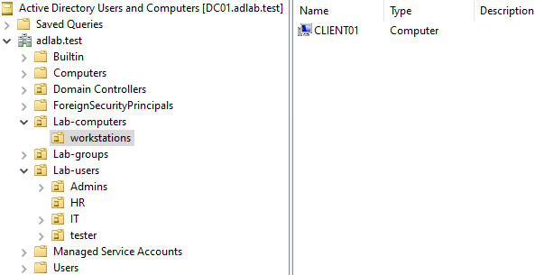

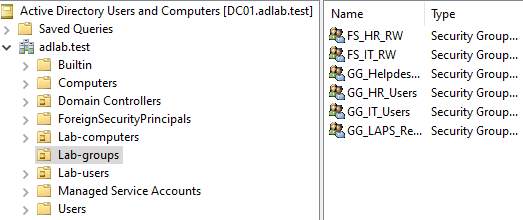

Security groups were used for departmental access, helpdesk delegation, and LAPS permissions.

File access follows the AGDLP model:

```text
Account → Global Group → Domain Local Group → Permission
```

Example:

```text
IT User
   ↓
GG_IT_Users
   ↓
FS_IT_RW
   ↓
\\DC01\IT
```

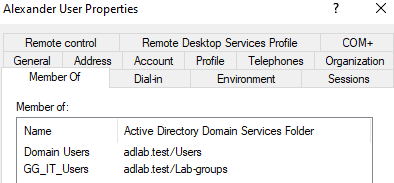

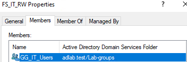

## Domain Join and DNS

CLIENT01 was joined to the `adlab.test` domain and configured to use DC01 as its DNS server.

Domain membership was verified using:

```
Get-ComputerInfo | Select-Object CsName,CsDomain
```

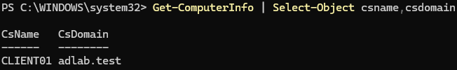

Client DNS configuration was verified using:

```
ipconfig /all
```
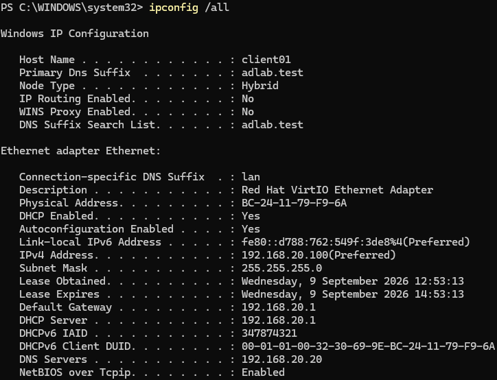

DC01 name resolution was tested with:

```
nslookup dc01.adlab.test
```
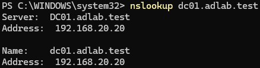

Active Directory service discovery was also verified using the LDAP SRV record:

```
nslookup -type=SRV _ldap._tcp.dc._msdcs.adlab.test
```
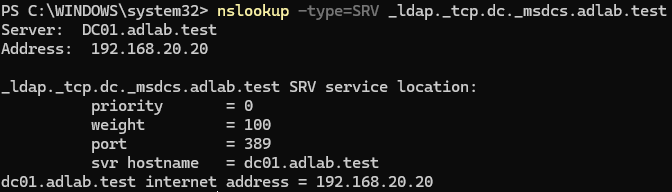

## File Shares and Access Control

Two departmental SMB shares were created:

```text
\\DC01\IT
\\DC01\HR
```

Mapped drives are deployed to users through Group Policy.

Access was verified so that:

- IT users can access the IT share but not the HR share
- HR users can access the HR share but not the IT share

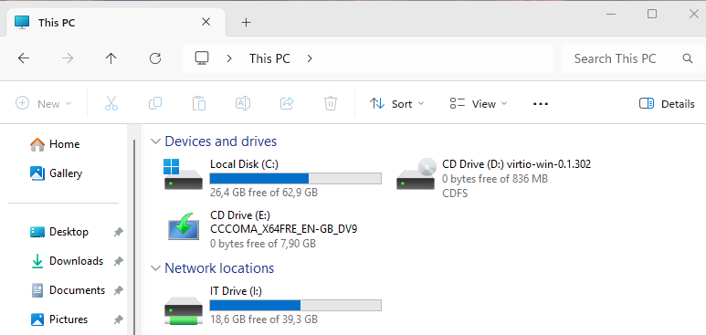

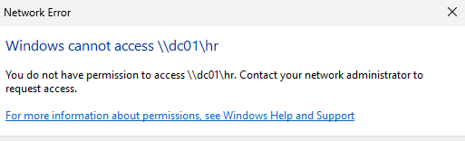

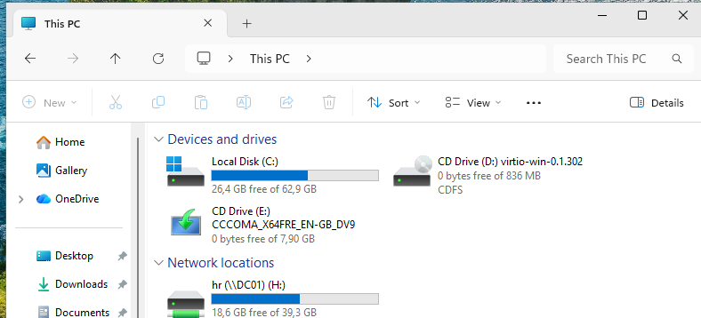

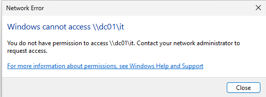

## Group Policy

Several workstation policies were deployed using Group Policy:

```text
GPO-Workstations-Test
GPO-Workstation-Firewall
GPO-Workstations-LAPS
```

Policy application on CLIENT01 was verified using:

```
gpresult /scope computer /r
```

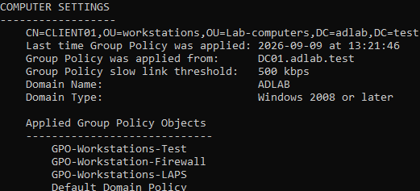

